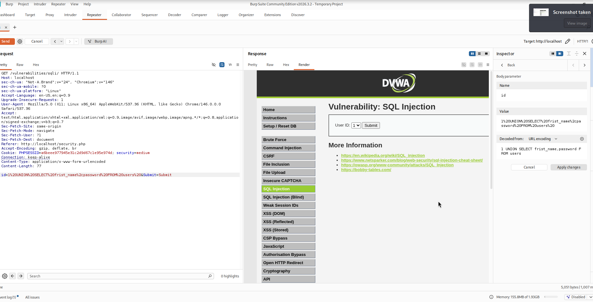

# Fiche — SQL Injection (SQLi)

## Contexte du lab

| Élément | Détail |
|---|---|
| Plateforme | DVWA (Damn Vulnerable Web Application) — exercice Jedha |
| Environnement | localhost — VM lab autorisée |
| Outil d'analyse | Burp Suite (interception requêtes, inspection paramètres) |
| Rencontré aussi | Lab EvilCorp (pentest encadré, mai 2026) — interface d'administration |
| Environnement autorisé | Oui |

---

## Ce qu'est une injection SQL

Une application construit des requêtes SQL en concaténant directement ce que l'utilisateur a saisi.
Si ce contenu n'est pas filtré, l'attaquant peut modifier la logique de la requête
— non plus "cherche l'utilisateur n°1" mais "renvoie-moi toute la table des mots de passe".

Le problème central : le code SQL et les données utilisateur sont mélangés.
Séparer les deux (requêtes préparées) suffit à éliminer la vulnérabilité dans la majorité des cas.

---

## Mécanisme technique

La requête vulnérable ressemble typiquement à :

```sql
SELECT first_name, last_name FROM users WHERE user_id = '$id';
```

Si `$id` vaut `1`, tout va bien. Si l'entrée n'est pas contrôlée, on peut soumettre :

```
1' OR '1'='1
```

Ce qui produit :

```sql
SELECT first_name, last_name FROM users WHERE user_id = '1' OR '1'='1';
```

La condition est toujours vraie — l'application renvoie tous les enregistrements.

---

## Ce que j'ai fait en lab (DVWA)

### Étape 1 — Détecter le point d'injection

Dans Burp Suite, le paramètre `id` (champ User ID du formulaire) était clairement visible dans la requête GET.
En soumettant une apostrophe `'`, la réponse renvoyait une erreur SQL contenant un message du SGBD —
confirmation que l'entrée était insérée brute dans la requête.



### Étape 2 — Identifier la structure avec UNION

L'injection UNION permet de coller des colonnes supplémentaires à la requête d'origine
et de récupérer des données d'autres tables.

Burp Inspector montrait le paramètre `id` décodé avec des éléments de requête SQL visibles,
et la réponse retournait des colonnes `first_name` et `password` extraites de la table `users`.

### Étape 3 — Impact observé

La réponse contenait des noms et des hashs de mots de passe de la table utilisateurs.
L'accès à ces données confirme qu'une injection UNION-based bien conduite permet
d'exfiltrer l'intégralité d'une table sans aucun droit particulier côté application.

---

## Dans le contexte du pentest lab (EvilCorp, mai 2026)

La vulnérabilité VULN-04 du rapport de pentest correspond à une injection SQL sur une interface d'administration.
Sévérité CVSS 3.1 : **9.1 Critical** (CWE-89).

La chaîne d'attaque documentée confirme que cette injection constituait l'un des vecteurs d'accès initiaux,
en parallèle de l'injection de commande et de la XSS stockée.

*(Détails opérationnels retirés du rapport public — voir le [rapport de pentest](https://github.com/Deagant/pentest-lab-report-portfolio).)*

---

## Impact potentiel

| Impact | Description |
|---|---|
| Extraction de données | Identifiants, hashs de mots de passe, données personnelles |
| Contournement d'authentification | `OR '1'='1` peut permettre de se connecter sans mot de passe valide |
| Énumération du schéma | `information_schema` expose tables, colonnes, types |
| Modification de données | `UPDATE` / `DELETE` si l'accès en écriture le permet |
| Exécution de commandes | `xp_cmdshell` sur MSSQL, `LOAD_FILE` sur MySQL selon configuration |

---

## Remédiation

| Mesure | Pourquoi |
|---|---|
| Requêtes préparées | `SELECT * FROM users WHERE id = ?` — le paramètre n'est jamais interprété comme du SQL |
| ORM | Paramétrise automatiquement, réduit la surface de risque |
| Validation des entrées | Si le champ attend un entier, rejeter tout ce qui n'est pas un entier |
| Moindre privilège sur le compte BDD | Le compte applicatif ne doit pas avoir `DROP`, `xp_cmdshell` ni les droits admin |
| Erreurs génériques en production | Ne pas exposer le message d'erreur du SGBD — il facilite la reconnaissance |
| WAF | Couche de détection complémentaire, mais pas suffisante seule |

---

## Ce que j'ai appris

- La syntaxe d'une injection UNION et pourquoi le nombre de colonnes doit correspondre à la requête d'origine
- Pourquoi les messages d'erreur du SGBD sont précieux pour l'attaquant — et doivent être masqués en prod
- La différence entre injection aveugle (boolean-based, time-based) et injection avec retour visible
- Que la même vulnérabilité CWE-89 peut se noter 9.1 sur une interface admin (impact élevé) ou moins selon le contexte
